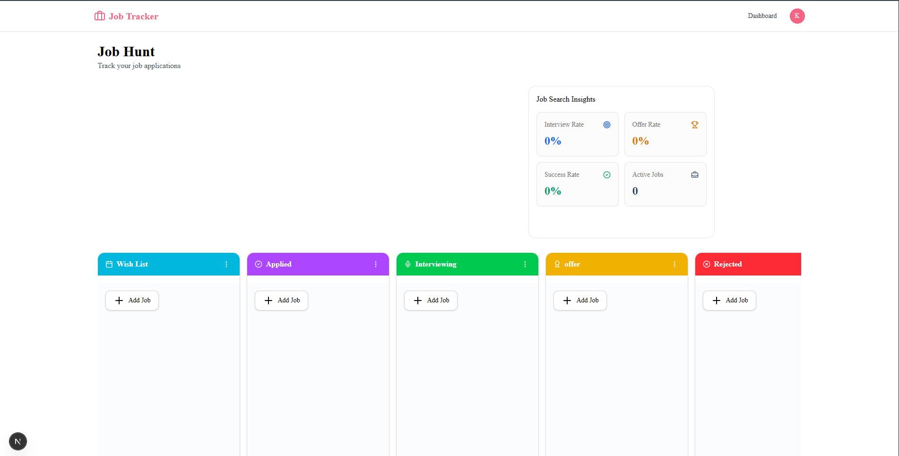
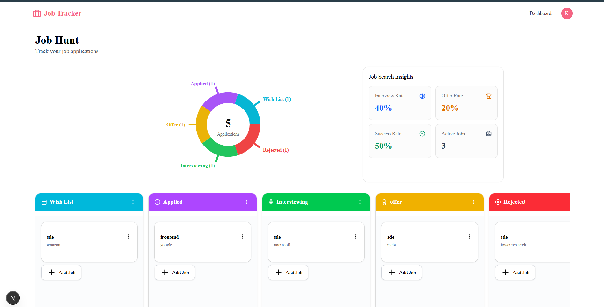
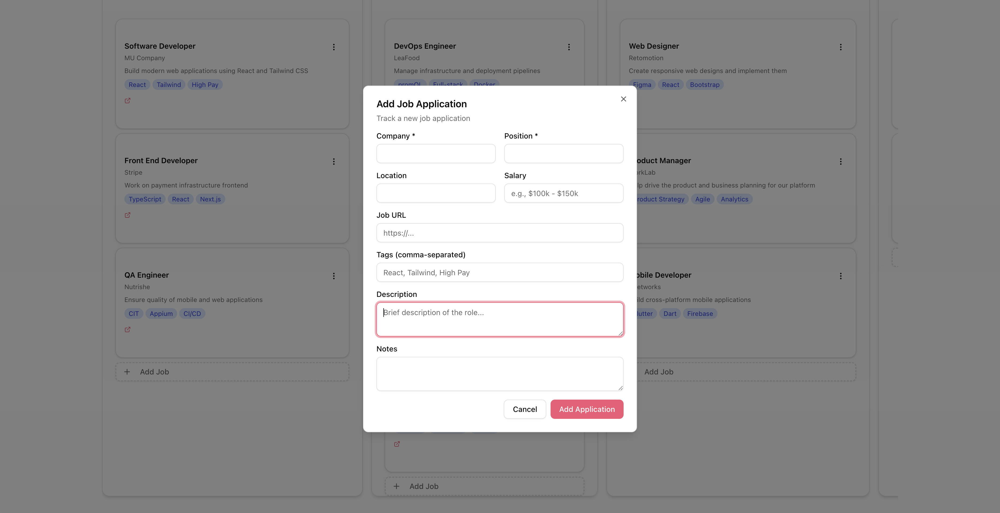

# Job Application Tracker

A full-stack job application management platform built with Next.js that helps users organize and track their job search process.

Users can manage applications across different stages of the hiring pipeline, move applications between stages using drag-and-drop, and gain insights through analytics and visual reports.

---

## 🚀 Features

### Application Management

- Create and manage job applications
- Store company name, role, location, and notes
- Track application progress throughout the hiring process

### Workflow Tracking

Manage applications across five stages:

- Wishlist
- Applied
- Interviewing
- Offer
- Rejected

### Drag and Drop

- Smooth drag-and-drop functionality using DnD Kit
- Move applications between stages instantly
- Real-time UI updates

### Authentication

- Secure email authentication using Better Auth
- Protected routes
- User-specific application data

### Analytics Dashboard

- Interactive pie chart visualization
- Total applications count
- Active applications tracking
- Interview rate calculation
- Offer rate calculation
- Success rate calculation

### Responsive Design

- Mobile-friendly UI
- Clean and modern interface
- Built with Shadcn UI and Tailwind CSS

---

## 🛠️ Tech Stack

### Frontend

- Next.js 16
- React 19
- TypeScript
- Tailwind CSS
- Shadcn UI

### Backend

- Next.js Route Handlers
- Server Components
- Better Auth

### Database

- MongoDB
- Mongoose

### Charts & Analytics

- Recharts

### Drag and Drop

- DnD Kit

### Email Services

- Resend

---

## ✨ Key Highlights

- Kanban-style job application workflow
- Drag-and-drop application management
- Interactive analytics dashboard
- Secure authentication system
- Responsive design
- Full-stack architecture using Next.js

---

## 📸 Screenshots

## Dashboard



## Analytics



## Add job application


---

## 📂 Project Structure

```txt
app/
├── dashboard/
├── sign-in/
├── sign-up/

components/
├── dashboard/
├── ui/

lib/
├── auth/
├── db.ts
├── models/

public/
├── hero-image/
```

## ⚙️ Environment Variables

Create a `.env.local` file in the root directory:

```env
MONGODB_URI=your_mongodb_connection_string

BETTER_AUTH_SECRET=your_secret

BETTER_AUTH_URL=http://localhost:3000

RESEND_API_KEY=your_resend_api_key
```

---

## 🚀 Getting Started

### Clone the Repository

```bash
git clone https://github.com/your-username/job-application-tracker.git
```

### Navigate to Project Directory

```bash
cd job-application-tracker
```

### Install Dependencies

```bash
npm install
```

### Run Development Server

```bash
npm run dev
```

Open:

```txt
http://localhost:3000
```

---

## 📊 Analytics Metrics

The dashboard provides:

- Total Applications
- Active Applications
- Interview Rate
- Offer Rate
- Success Rate

These metrics help users evaluate the effectiveness of their job search process.

---

---

## 🎯 Learning Outcomes

This project demonstrates:

- Full-stack development with Next.js
- Authentication and authorization
- MongoDB data modeling
- Drag-and-drop interfaces
- Data visualization with charts
- TypeScript development
- Responsive UI design
- Modern React patterns

---

## 📄 License

This project is licensed under the MIT License.

---

## 👨‍💻 Author

Krishna Gopal

GitHub: https://github.com/your-github-username
LinkedIn: https://linkedin.com/in/your-linkedin-profile
